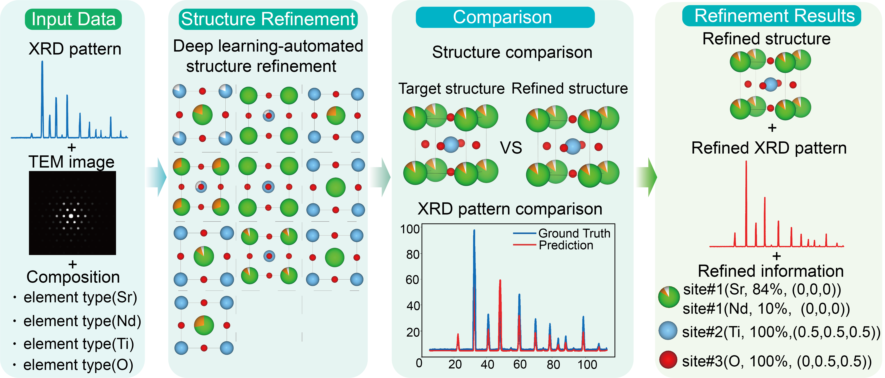

# MCSRNet

<div align='center'>
 
<!-- [](https://www.google.com/) -->
[](https://opensource.org/licenses/MIT)

</div>

**Title** - MCSRNet: Structure interpretation via Generative Model and Multimodal Strategies from Characterization Data

---

## Table of Contents

- [MCSRNet](#MCSRNet)
  - [Table of Contents](#table-of-contents)
  - [Introduction](#introduction)
  - [Model Architecture](#model-architecture)
  - [Getting Started](#getting-started)
    - [Prerequisites](#prerequisites)
  - [Model Files](#Model-Files)
    - [CLIP Model](#CLIP Model)
	- [Diffusion Model](#Diffusion Model)
  - [License](#license)
  - [Citation](#citation)
  - [Acknowledgements](#acknowledgements)

---

## Introduction
This work presents a Multimodal Crystal Structure Refinement Network (MCSRNet) that systematically explores the synergistic potential of multimodal data in crystal structure refinement. Based on a CLIP-pretrained XRD–TEM representation model, MCSRNet establishes a unified embedding space for the two modalities, enabling deep cross-modal feature fusion. Incorporating compositional information, it further introduces an XRD–TEM-based crystal structure generation module that achieves end-to-end prediction of complete three-dimensional crystal structures, including lattice parameters, atomic positions, element types, and fractional occupancies. Under the setting of generating ten candidate structures, MCSRNet achieves over 85% match accuracy across six representative structure types—such as perovskite, rocksalt, and spinel—and exceeds 95% accuracy in four of them, demonstrating exceptional generation accuracy, robustness, and generalization across diverse crystallographic systems.

> **Keywords**: Deep learning, Multimodal learning, Automated Laboratories, Crystal structure refinement, Diffusion model

## Model Architecture
As illustrated in Figure 1, the workflow consists of multimodal input, structure refinement, and structure comparison. The inputs include XRD patterns, TEM images, and compositional data. In the refinement stage, the model requires approximately 58 seconds to generate one CaTiO₃-type structure and 580 seconds for ten candidates, while for more complex systems such as spinel, generating ten candidates takes only 3720 seconds; therefore, ten candidates are used by default to balance accuracy and computational cost. During the comparison stage, a candidate is regarded as valid only if it satisfies the structural similarity threshold and achieves a cosine similarity greater than 70% between its simulated and target XRD patterns. Among all valid candidates, the one with the highest similarity is selected as the optimal structure, ensuring consistency in both geometric configuration and diffraction features. The final outputs include lattice parameters, atomic positions, element types, and fractional occupancies, which are exported as a CIF file; a high-fidelity simulated XRD pattern is also generated, enabling closed-loop validation between the predicted structure and the input diffraction data. This workflow demonstrates the high accuracy, reliability, and automation capability of MCSRNet for crystal structure refinement from multimodal characterization data.



Further explain the details in the [paper](https://github.com/PKUsam2023/MCSRNet), providing context and additional information about the architecture and its components.

## Getting Started

### prerequisites
The code in this repo has been tested with the following software versions:
python==3.8.13
torch==1.9.0
torch-geometric==1.7.2
pytorch_lightning==1.3.8
pymatgen==2023.8.10

The installation can be done quickly with the following statement.
```
pip install -r requirements.txt
```

We recommend using the Anaconda Python distribution, which is available for Windows, MacOS, and Linux. Installation for all required packages (listed above) has been tested using the standard instructions from the providers of each package.

## Model-Files

### CLIP Model
For XRD-TEM CLIP Model:

Training: python ./XRD-TEM CLIP/train.py

Validation / Inference: python ./XRD-TEM CLIP/apply.py

For XRD CLIP Model:

Training: python ./XRD CLIP/train.py

Validation / Inference: python ./XRD CLIP/apply.py

### Diffusion Model
Training: python ./Diffusion/main/run.py data=<dataset> expname=<expname>

The <dataset> tag can be selected from perov_CaTiO3, perov_GdFeO3, perov_NdAlO3 and , and the <expname> tag can be an arbitrary name to identify each experiment.

Please download the dataset and model checkpoints from Zenodo:10.5281/zenodo.17896706. Please place them into the correct directories after downloading: rename best_xrd.pt by removing the _xrd suffix and put it into ./XRD CLIP/; rename best_xrd_TEM.pt by removing the _xrd_TEM suffix and put it into ./XRD-TEM CLIP/; place epoch=699-step=246399.ckpt into ./Diffusion/output/HYDRA/2025-03-12/perov_CaTiO3/; and after extracting the data archive, move the resulting folder into ./Diffusion/.

Evaluation:

One sample:

python ./Diffusion/scripts/evaluate.py --model_path <model_path> --dataset <dataset>

python ./Diffusion/scripts/compute_metrics.py --root_path <model_path> --tasks csp --gt_file data/<dataset>/test.csv 

Multiple samples:

python ./Diffusion/scripts/evaluate.py --model_path <model_path> --dataset <dataset> --num_evals 10

python ./Diffusion/scripts/compute_metrics.py --root_path <model_path> --tasks csp --gt_file data/<dataset>/test.csv --multi_eval

## License

This project is licensed under the MIT License - see the [LICENSE](LICENSE) file for details.

## Citation
If you use this code or the pre-trained models in your work, please cite our work. 

- "MCSRNet: Structure interpretation via Generative Model and Multimodal Strategies from Characterization Data"

## Acknowledgments
The main framework of the Diffusion part is build upon DiffCSP. All entries in the database were extracted and curated from the ICSD.
